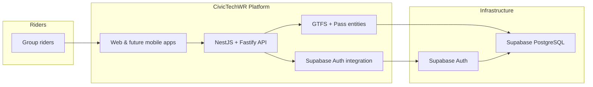

# Go Train Group Pass

Interested in helping out? Start with [`CONTRIBUTING.md`](CONTRIBUTING.md) for meetup details, setup steps, and collaboration norms.

## Product Overview

Go Train Group Pass is a civic-tech collaboration that streamlines the purchase and coordination of GO Transit group passes. The platform exposes authenticated APIs, GTFS-powered data services, and admin tools that downstream web or mobile clients use to help riders plan trips, manage eligibility, and share passes across a group.

- [Technical Design Document (Notion, WIP)](https://www.notion.so/Technical-Design-Document-WIP-2a1e01ee4c0080a391bfcd52b067f9a9)
- [Product and UX boards (Figma)](https://www.figma.com/board/5AhW638DdlgCooNjtEZnEG/Metrolinx-Group-Pass?node-id=0-1&t=e1jtwAZg5bLGRAGI-1)

### Product Principles

- **Support stewards, not replace them:** The app augments the existing steward-led process and does not referee peer-to-peer payments.
- **Time-sensitive coordination:** Push notifications and real-time status cues are core to keeping the group aligned in the minutes leading up to boarding and while on the train.
- **Clarity over chat scrollback:** Interfaces focus on surfacing the current itinerary state rather than relying on ad-hoc messaging threads.

### Rider Journey Stages

The product vision spans four coordination stages captured in the Notion design brief. The current MVP focuses on the in-progress phases while the bookend steps remain in discovery:

1. **Pre-board (MVP):** Final group formation happens minutes before departure as stewards purchase and share pass details.
2. **On board (MVP):** Riders may be seated apart; quick regrouping and proof-of-purchase handling (e.g., fare inspections) is essential.
3. **Pre-planning (Future):** Riders signal interest in outbound or return itineraries and nominate potential stewards.
4. **Post board (Future):** Stewards reconcile payments and capture participation outcomes for the return leg.

## Technology Stack

- **Backend:** NestJS 11 (Fastify adapter), TypeScript, MikroORM (PostgreSQL)
- **Authentication:** Supabase Auth (JWT session tokens)
- **Data Source:** GO Transit GTFS feeds mapped into Supabase PostgreSQL 17
- **Frontend (planned):** Next.js + React web client (currently in discovery; implementation will land in a dedicated frontend workspace)
- **Tooling:** ESLint, Prettier, Vitest, SWC, ts-node
- **Automation:** GitHub Actions for linting, accessibility audits, and security scans

Reference: `backend/package.json` and [`backend/README.md`](backend/README.md#tech-stack).

## Architecture Overview

- High-level flow: the Mermaid chart above captures rider, platform, and Supabase interactions. The broader MVP coordination stages live in the Technical Design Document linked in the Product Overview.
- Backend modules and entities are documented in [`backend/README.md`](backend/README.md#project-structure) and [`backend/AUTH_SETUP.md`](backend/AUTH_SETUP.md#architecture).
- Supabase infrastructure and local parity live in [`backend/SUPABASE_SETUP.md`](backend/SUPABASE_SETUP.md).

## Getting Started

Follow the guide for the area you plan to work on:

| Surface            | Status       | Setup Guide                                                                                                                                                    |
| ------------------ | ------------ | -------------------------------------------------------------------------------------------------------------------------------------------------------------- |
| Backend API        | Active       | [`backend/README.md#getting-started`](backend/README.md#getting-started)                                                                                       |
| Supabase stack     | Active       | [`backend/SUPABASE_SETUP.md`](backend/SUPABASE_SETUP.md)                                                                                                       |
| Frontend (Next.js) | In discovery | Track progress in [Figma board](https://www.figma.com/board/5AhW638DdlgCooNjtEZnEG/Metrolinx-Group-Pass?node-id=0-1&t=e1jtwAZg5bLGRAGI-1) and forthcoming docs |

## Project Structure

- **`backend/`** — NestJS application modules, MikroORM entities, and Vitest suites. See [`backend/README.md#project-structure`](backend/README.md#project-structure) for file-level detail.
- **`supabase/`** — Local Supabase configuration (CLI, database, auth) that mirrors hosted infrastructure.
- **`.github/workflows/`** — Automation pipelines for linting, accessibility, and security checks that gate pull requests.
- **UX & product specs** — Living documents in [Notion](https://www.notion.so/Technical-Design-Document-WIP-2a1e01ee4c0080a391bfcd52b067f9a9#2a1e01ee4c00805b9432d69102af7a43) and [Figma](https://www.figma.com/board/5AhW638DdlgCooNjtEZnEG/Metrolinx-Group-Pass?node-id=0-1&t=e1jtwAZg5bLGRAGI-1) capture workflows and visual design decisions that have not yet landed in this repo.

## Key Features

### Current Capabilities

- Account creation and authentication so riders and stewards can sign in securely.
- Itinerary and schedule data modeled from GO Transit GTFS feeds to anchor trip planning conversations.
- Steward-centric flows in the backend (sign-up, session management, upcoming itinerary endpoints) that support day-of coordination (`pre-board` and `on-board` stages).

### In Flight

- Guided UI flows for each journey stage with context-aware push notifications.
- Steward workspace to share proof-of-purchase, confirm rider check-ins, and track reimbursements.
- Rider-facing status views including a lightweight schedule viewer and reminders for boarding and regrouping moments.

Refer to the [Technical Design Document](https://www.notion.so/Technical-Design-Document-WIP-2a1e01ee4c0080a391bfcd52b067f9a9) for the full backlog and target experience.

## Development Workflow

- Work from feature branches aligned with the contribution templates in [`.github/ISSUE_TEMPLATE/`](.github/ISSUE_TEMPLATE/) and [`pull_request_template.md`](.github/pull_request_template.md).
- Automated checks run on every push/PR; monitor the GitHub Action badges or run equivalents locally (`npm run lint`, `npm run type-check`, `npm run test`).
- Consult the [Notion workflow analysis section](https://www.notion.so/Technical-Design-Document-WIP-2a1e01ee4c0080a391bfcd52b067f9a9#2a1e01ee4c0080c0beaa576dc85df8ba) for sprint cadence and release planning.

## Coding Standards

- Style and linting rules are defined in `backend/.eslintrc.json` and enforced through `npm run lint` (see [`backend/README.md#code-quality`](backend/README.md#code-quality)).
- Formatting relies on Prettier; use `npm run format` / `npm run format:check`.
- All pull requests must pass the GitHub workflows (lint, accessibility, security) before merging.
- Domain-driven patterns and DTO validation details live in the corresponding backend documentation sections to reduce duplication.

## Testing

- A full overview of unit, integration, e2e, coverage, and accessibility testing lives in [`backend/README.md#testing`](backend/README.md#testing) and the associated scripts (`package.json`).
- CI executes the same commands, including accessibility audits via Playwright + axe (`npm run test:a11y`) and scheduled security scans.

## Contributing

- Review the [Notion product roadmap](https://www.notion.so/Technical-Design-Document-WIP-2a1e01ee4c0080a391bfcd52b067f9a9) and [Figma flows](https://www.figma.com/board/5AhW638DdlgCooNjtEZnEG/Metrolinx-Group-Pass?node-id=0-1&t=e1jtwAZg5bLGRAGI-1) for context before drafting solutions.
- Use the issue templates to capture requirements; follow the pull-request checklist to surface tests, migrations, and Supabase changes.
- Reference code patterns in `backend/src` and examples in future `docs/` entries rather than duplicating snippets here, keeping the README evergreen.

## License

This repository does not yet declare a license. Coordinate with CivicTechWR maintainers before using the code outside the project.
