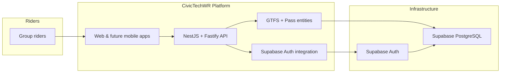

# GO Train Group Pass Coordinator

[](https://github.com/CivicTechWR/go-train-group-pass/actions/workflows/lint.yml)
[](https://github.com/CivicTechWR/go-train-group-pass/actions/workflows/accessibility.yml)
[](https://github.com/CivicTechWR/go-train-group-pass/actions/workflows/security.yml)

**Helping Kitchener-Waterloo commuters save money and stay safe by coordinating GO Transit group passes**

-----

## 🚨 We Need Frontend Help

Our backend is built and working, but we have **no user interface yet**. We’re looking for frontend developers (or people willing to learn React/Next.js) to help build the web app. See [Contributing](#contributing) for details.

-----

## The Problem

GO Transit offers [Weekday Group Passes](https://www.gotransit.com/en/partners-and-promotions/weekday-group-passes) that let 2-5 people travel together all day for a flat rate (starting at $30). They’re a great deal—but coordinating with strangers via WhatsApp groups is messy and risky:

- Hard to find people traveling your route at your time
- Chaotic group chats with last-minute dropouts
- Awkward money collection and pass sharing
- **Your phone number gets exposed to strangers** - creating risk of stalking or unwanted contact
- No way to verify who’s actually showing up

This app fixes that by making group coordination simple, reliable, transparent, and **private**. Only the ticket steward (pass purchaser) shares their contact info—everyone else can stay anonymous.

## Product Overview

Go Train Group Pass is a civic-tech collaboration that streamlines the purchase and coordination of GO Transit group passes. The platform provides authenticated APIs, GTFS-powered schedule data, and coordination tools that help riders plan trips, form groups, and share passes safely.

- [Technical Design Document (Notion, WIP)](https://www.notion.so/Technical-Design-Document-WIP-2a1e01ee4c0080a391bfcd52b067f9a9)
- [Product and UX boards (Figma)](https://www.figma.com/board/5AhW638DdlgCooNjtEZnEG/Metrolinx-Group-Pass?node-id=0-1&t=e1jtwAZg5bLGRAGI-1)

### Product Principles

- **Support stewards, not replace them:** The app augments the existing steward-led process and does not referee peer-to-peer payments.
- **Privacy by design:** Only the ticket steward shares contact information. Other group members stay anonymous until they choose otherwise.
- **Time-sensitive coordination:** Clear status cues keep the group aligned in the minutes leading up to boarding and while on the train.
- **Clarity over chat scrollback:** Interfaces focus on surfacing the current itinerary state rather than relying on ad-hoc messaging threads.

## What We’re Building

A web app where commuters can:

1. **Find travel partners** - Search for people going your route at your time
1. **Form groups automatically** - Get matched with compatible travelers (2-5 people)
1. **Coordinate meetups** - Agree on meeting spot, confirm arrival
1. **Protect your privacy** - Only the ticket steward (pass purchaser) shares contact info
1. **Handle the pass** - One person buys, everyone gets proof of group membership
1. **Split costs fairly** - Track who owes what (payment happens outside the app for now)

## Current Status & Roadmap

### Rider Journey Stages

The stages below map to open issues and our development epics:

#### 1. Pre-planning (Epic 1: Trip Discovery & Planning - 70% done)

Search schedules, create itineraries, plan your trips

- ✅ GTFS data import and refresh
- ✅ One-way trip schedule search
- ✅ Round-trip Kitchener-Union query
- 🔄 Generic round-trip endpoint
- 🔄 Itinerary creation flow
- Issues: [#64–66](https://github.com/CivicTechWR/go-train-group-pass/issues?q=is%3Aissue+is%3Aopen+64..66), [#74–86](https://github.com/CivicTechWR/go-train-group-pass/issues?q=is%3Aissue+is%3Aopen+74..86)

#### 2. Pre-board - MVP Priority

**Epic 2: Group Formation & Matching (40% done)**  
**Epic 3: Group Coordination (0% done)**

Group formation, check-in, QR/scan, and steward confirmations

- ✅ Database schema (travel_group, trip_booking)
- ✅ Group formation background job
- 🔄 Manual group formation trigger
- ❌ Group chat/messaging
- ❌ Meetup location selection
- ❌ Member check-in status
- ❌ **Frontend interface** (blocking everything)
- Issues: [#67–71](https://github.com/CivicTechWR/go-train-group-pass/issues?q=is%3Aissue+is%3Aopen+67..71), [#93–100](https://github.com/CivicTechWR/go-train-group-pass/issues?q=is%3Aissue+is%3Aopen+93..100), [#104–110](https://github.com/CivicTechWR/go-train-group-pass/issues?q=is%3Aissue+is%3Aopen+104..110)

#### 3. On board - MVP Priority

**Epic 3: Group Coordination (continued)**

Steward tools for verification and regrouping

- ❌ Active pass display
- ❌ Real-time group status
- ❌ Steward broadcast tools
- Issues: Same as Pre-board

#### 4. Post board

**Epic 4: Pass Purchase & Activation (20% done)**  
**Epic 5: Payment Settlement (0% done)**

Ticket purchase, cost splits, and payments/reconciliation

- ✅ Database schema (ticket_purchase, payment tables)
- ❌ Pass purchase workflow
- ❌ Cost calculation & display
- ❌ Payment tracking
- Issues: [#72–73](https://github.com/CivicTechWR/go-train-group-pass/issues?q=is%3Aissue+is%3Aopen+72..73), [#107–115](https://github.com/CivicTechWR/go-train-group-pass/issues?q=is%3Aissue+is%3Aopen+107..115)

### Additional Epics (Not Started)

**Epic 6: Notifications & Alerts (0% done)**

- Trip reminders, group updates, service disruptions
- Critical for user adoption post-MVP

**Epic 7: User Experience / Frontend (0% done) ⚠️ BLOCKING**

- Web interface - without this, nothing else matters
- Issues: [#26](https://github.com/CivicTechWR/go-train-group-pass/issues/26), [#52](https://github.com/CivicTechWR/go-train-group-pass/issues/52)

**Epic 8: Safety & Trust (0% done)**

- User verification, reporting, blocking, moderation
- Can defer to post-MVP but important for scale

### System Architecture


```mermaid
flowchart LR
    subgraph Riders
        EndUsers[Group riders]
    end
    subgraph CivicTechWR Platform
        Clients[Web & future mobile apps]
        API[NestJS + Fastify API]
        AuthGuard[Supabase Auth integration]
        Data[GTFS + Pass entities]
    end
    subgraph Infrastructure
        SupabaseAuth[Supabase Auth]
        SupabaseDB[Supabase PostgreSQL]
    end

    EndUsers --> Clients --> API
    API --> AuthGuard
    AuthGuard --> SupabaseAuth
    API --> Data --> SupabaseDB
    SupabaseAuth --> SupabaseDB
```

## Technology Stack

**Backend (completed):**

- NestJS 11 (Fastify adapter), TypeScript
- PostgreSQL + MikroORM
- Supabase Auth (JWT session tokens)
- GTFS transit data processing

**Frontend (planned - need help!):**

- Next.js 14+ (App Router)
- React + TypeScript
- Tailwind CSS (or your preference)
- Real-time updates (WebSockets or polling)

**Tooling:**

- ESLint, Prettier, Vitest, SWC, ts-node
- GitHub Actions for linting, accessibility audits, and security scans

Reference: `backend/package.json` and [`backend/README.md`](backend/README.md#tech-stack).

## Getting Started

Interested in helping out? Start with [`CONTRIBUTING.md`](CONTRIBUTING.md) for meetup details, setup steps, and collaboration norms.

### Quick Start for Developers

**Prerequisites:**

- Node.js 18+ and npm
- PostgreSQL (or use our Supabase setup)
- Basic familiarity with REST APIs

**Get the backend running:**

```bash
git clone https://github.com/CivicTechWR/go-train-group-pass.git
cd go-train-group-pass
npm install
cd backend
npm run dev
```

See detailed setup guides:

|Surface           |Status |Setup Guide                                                                                                                                                 |
|------------------|-------|------------------------------------------------------------------------------------------------------------------------------------------------------------|
|Backend API       |Active |[`backend/README.md#getting-started`](backend/README.md#getting-started)                                                                                    |
|Supabase stack    |Active |[`backend/SUPABASE_SETUP.md`](backend/SUPABASE_SETUP.md)                                                                                                    |
|Frontend (Next.js)|Planned|Track via issues [#26](https://github.com/CivicTechWR/go-train-group-pass/issues/26) and [#52](https://github.com/CivicTechWR/go-train-group-pass/issues/52)|

**Want to build the frontend?** Talk to us first! We’ll help you:

- Understand the API endpoints
- Set up your development environment
- Get access to our Figma designs
- Connect with the team

## Project Structure

- **`backend/`** — NestJS application modules, MikroORM entities, and Vitest suites. See [`backend/README.md#project-structure`](backend/README.md#project-structure) for file-level detail.
- **`packages/shared/`** — Shared TypeScript types and DTOs
- **`supabase/`** — Local Supabase configuration (CLI, database, auth) that mirrors hosted infrastructure.
- **`spec/`** — Technical specifications and process documentation
- **`.github/workflows/`** — Automation pipelines for linting, accessibility, and security checks that gate pull requests.
- **UX & product specs** — Living documents in [Notion](https://www.notion.so/Technical-Design-Document-WIP-2a1e01ee4c0080a391bfcd52b067f9a9) and [Figma](https://www.figma.com/board/5AhW638DdlgCooNjtEZnEG/Metrolinx-Group-Pass?node-id=0-1&t=e1jtwAZg5bLGRAGI-1) capture workflows and visual design decisions.

Frontend will go in a new folder (we need someone to set it up!)

## Contributing

We welcome contributors of all skill levels:

- **Frontend Developers (URGENT NEED):** React/Next.js experience to build the user interface
- **Backend Developers:** Help finish APIs, improve testing, optimize queries
- **Designers:** UX/UI, user research, accessibility design
- **Testers:** QA, user testing, feedback on flows
- **Writers:** Documentation, help content, privacy policies
- **Anyone interested:** Come learn with us!

### Time Commitment

- **90-120 minutes/week** at Wednesday hack nights
- More if you want to contribute outside of meetups
- Even occasional contributions (once a month) are valuable

### Why Join This Project

- Real impact for local commuters
- Portfolio piece with actual users
- Supportive civic tech community
- Flexible volunteer hours
- Learn from experienced developers

### How to Get Involved

1. **Join our community:**
- Slack: [CivicTechWR workspace](https://join.slack.com/t/civictechwr/shared_invite/zt-2hk4c93hv-DEIbxR_z1xKj8cZmayVHTw)
- Weekly hacknights: [Schedule](https://docs.google.com/spreadsheets/d/1hAxstCyiVBdYeSQlIrlkhnSntJLJ3kNnoCuechFJN7E/edit?gid=0#gid=0)
1. **Pick an issue or propose a feature:**
- Look for `good first issue` or `help wanted` labels
- Comment on the issue to claim it
- Ask questions if anything is unclear
1. **Submit your work:**
- Fork the repo
- Create a feature branch
- Follow our code style (Prettier + ESLint configured)
- Write tests for new features
- Submit a pull request

Read our [Code of Conduct](CODE_OF_CONDUCT.md) and check out [open issues](https://github.com/CivicTechWR/go-train-group-pass/issues).

## Development Workflow

- Work from feature branches aligned with the contribution templates in [`.github/ISSUE_TEMPLATE/`](.github/ISSUE_TEMPLATE/) and [`pull_request_template.md`](.github/pull_request_template.md).
- Automated checks run on every push/PR; monitor the GitHub Action badges or run equivalents locally (`npm run lint`, `npm run type-check`, `npm run test`).
- Consult the [Notion workflow analysis section](https://www.notion.so/Technical-Design-Document-WIP-2a1e01ee4c0080a391bfcd52b067f9a9#2a1e01ee4c0080c0beaa576dc85df8ba) for sprint cadence and release planning.

## Coding Standards

- Style and linting rules are defined in `backend/.eslintrc.json` and enforced through `npm run lint` (see [`backend/README.md#code-quality`](backend/README.md#code-quality)).
- Formatting relies on Prettier; use `npm run format` / `npm run format:check`.
- All pull requests must pass the GitHub workflows (lint, accessibility, security) before merging.
- Domain-driven patterns and DTO validation details live in the corresponding backend documentation sections to reduce duplication.

## Testing

- A full overview of unit, integration, e2e, coverage, and accessibility testing lives in [`backend/README.md#testing`](backend/README.md#testing) and the associated scripts (`package.json`).
- CI executes the same commands, including accessibility audits via Playwright + axe (`npm run test:a11y`) and scheduled security scans.

## Frequently Asked Questions

### General Questions

**Q: Why not just keep using WhatsApp groups?**

A: WhatsApp groups expose everyone’s phone number to strangers, making people vulnerable to stalking or unwanted contact. Our app keeps you anonymous—only the ticket steward (who buys the pass) shares their contact info with the group.

**Q: How much does it cost to use?**

A: The app is completely free. You only pay for the GO Transit group pass itself (starting at $30 for 2 people).

**Q: Do I need to download an app?**

A: No! It’s a web app that works in your phone’s browser.

**Q: What if someone doesn’t show up?**

A: The app tracks check-ins and confirmations. If someone doesn’t confirm by a set time before departure, the group can be reformed or you can find a replacement. (This feature is still being built.)

**Q: Who buys the actual GO Transit pass?**

A: One person in the group (the “steward”) purchases the pass from GO Transit. The app helps track who owes money and confirms payment, but the actual money exchange happens outside the app (e-transfer, cash, etc.).

### Privacy & Safety

**Q: What information do other group members see about me?**

A: By default, only your first name and a profile photo (if you add one). Your phone number and email stay private. Only the ticket steward shares their contact info so the group can coordinate.

**Q: What if I get matched with someone I don’t want to travel with?**

A: You can leave a group at any time before the pass is purchased. We’re also building blocking and reporting features.

**Q: How do you prevent fake accounts or bad actors?**

A: We’re implementing user verification (email and/or SMS) and exploring additional trust features like reputation scores and verified user badges. This is part of our Safety & Trust epic (coming after launch).

### Technical Questions

**Q: What happens to my data?**

A: Your data is stored securely in our database. We only collect what’s necessary for the app to work (name, email, travel preferences). We don’t sell your data or share it with third parties. See our privacy policy (coming soon) for details.

**Q: Can I use this for weekend travel?**

A: Currently we’re focused on weekday group passes. Weekend passes work differently (individual $10 day passes), but we might support them in the future.

**Q: Does this work with PRESTO cards?**

A: No, GO Transit’s weekday group passes are only available as e-tickets, not through PRESTO. You buy them online and activate them on your phone.

### For Contributors

**Q: I’m not a developer, can I still help?**

A: Absolutely! We need designers, testers, writers, and people to help with user research. Come to a hacknight and tell us what you’re interested in.

**Q: I’m a beginner, is this project too advanced?**

A: Not at all. We welcome all skill levels. The backend is complex, but we can help you learn. If you’re interested in frontend, we’ll pair you with someone who can guide you.

**Q: What if I can only volunteer occasionally?**

A: That’s totally fine. Even showing up once a month and contributing a feature or bug fix is valuable. We work with people’s schedules.

**Q: Do you have a deadline?**

A: No hard deadline, but we’d love to launch something usable by spring 2025 when commuters are looking for ways to save money after winter.

## About CivicTech Waterloo Region

We’re a volunteer community using technology to solve local problems. We meet weekly for hacknights and monthly speaker sessions. Learn more at [civictechwr.org](https://civictechwr.org/).

## Questions?

- **Slack:** #go-train-group-pass channel in [CivicTechWR workspace](https://join.slack.com/t/civictechwr/shared_invite/zt-2hk4c93hv-DEIbxR_z1xKj8cZmayVHTw)
- **Issues:** [GitHub Issues](https://github.com/CivicTechWR/go-train-group-pass/issues)
- **In person:** Come to a hacknight! [See schedule](https://docs.google.com/spreadsheets/d/1hAxstCyiVBdYeSQlIrlkhnSntJLJ3kNnoCuechFJN7E/edit?gid=0#gid=0)

-----

**Ready to help build this?** Start by introducing yourself in our Slack channel or come to the next hacknight. We’d love to have you on the team.

## License

This repository does not yet declare a license. Coordinate with CivicTechWR maintainers before using the code outside the project.
