# GO Train Group Pass Coordination App

## CivicTechWR Season Project

[](https://github.com/CivicTechWR/CTWR-Project-Template-New/releases)
[](GETTING_STARTED.md)
[](LICENSE)

> New contributor? Jump to the **[Getting Started guide](GETTING_STARTED.md)** for a five-minute setup walkthrough. The documentation hub lives in [docs/index.md](docs/index.md).

Coordinate weekday GO Train group passes between Kitchener and Union Station without relying on WhatsApp threads. This project pairs a Next.js client with Supabase, tRPC, and shadcn/ui to automate group formation, steward workflows, and trip coordination.

## Table of Contents

- [GO Train Group Pass Coordination App](#go-train-group-pass-coordination-app)
  - [CivicTechWR Season Project](#civictechwr-season-project)
  - [Table of Contents](#table-of-contents)
  - [Features](#features)
  - [Current Process Flow](#current-process-flow)
  - [Getting Started](#getting-started)
    - [Prerequisites](#prerequisites)
    - [Installation](#installation)
    - [Local Development](#local-development)
  - [Environment](#environment)
    - [Admin Automation Endpoints](#admin-automation-endpoints)
  - [Common Tasks](#common-tasks)
  - [Project Structure](#project-structure)
  - [Documentation](#documentation)
  - [Contributing](#contributing)
  - [License](#license)

## Features

- Automated grouping algorithm that balances 2–5 riders and preserves steward assignments.
- Real-time trip updates powered by Supabase Realtime and tRPC.
- Steward tools for pass uploads, payment tracking, and alerting.
- Playwright + @axe-core/playwright for browser automation and accessibility audits.

## Current Process Flow

The following diagram illustrates the current group pass coordination process that this application is designed to enhance:

```mermaid
flowchart TD
    %% class definitions for consistent styling
    classDef phase fill:#f7f7f7,stroke:#bbb,stroke-width:1px,color:#222,font-size:14px,font-weight:bold;
    classDef action fill:#e3f2fd,stroke:#64b5f6,stroke-width:1px,color:#0d47a1,font-size:12px;
    classDef comm fill:#fff3e0,stroke:#ffb74d,stroke-width:1px,color:#e65100,font-size:12px;
    classDef payment fill:#e8f5e9,stroke:#81c784,stroke-width:1px,color:#1b5e20,font-size:12px;
    classDef decision fill:#fce4ec,stroke:#f06292,stroke-width:1px,color:#880e4f,font-size:12px,font-weight:bold;
    classDef milestone fill:#ede7f6,stroke:#9575cd,stroke-width:1px,color:#4527a0,font-weight:bold,font-size:13px;
    classDef terminal fill:#c5cae9,stroke:#5c6bc0,stroke-width:2px,color:#1a237e,font-weight:bold,font-size:13px;

    %% start point
    Start([📅 Start:<br/>day before or morning]):::milestone

    %% coordination phase
    subgraph Coordination["Group coordination (ongoing)"]
        Poll["Poll posted in WhatsApp<br/>max 5 per group"]:::comm
        Vote["Members vote<br/>or switch"]:::action
        Groups["Groups evolve<br/>until boarding"]:::comm
        Poll --> Vote --> Groups
    end
    class Coordination phase;

    %% boarding and pass purchase
    subgraph Boarding["Travel morning & boarding"]
        CheckIn["Members check in<br/>(coach & location)"]:::comm
        Confirm["Steward confirms<br/>headcount"]:::action
        Buy["Steward buys<br/>group pass"]:::action
        Screenshot["Post pass<br/>screenshot"]:::comm
        Board["Board train"]:::milestone
        CheckIn --> Confirm --> Buy --> Screenshot --> Board
    end
    class Boarding phase;

    %% payment handling
    subgraph PaymentFlow["Payment & accountability"]
        PaymentReq["Post payment<br/>request"]:::comm
        CreateTransfers["Create<br/>e-transfers"]:::payment
        MembersPay["Members send<br/>payments"]:::payment
        Track["Track<br/>completion"]:::payment
        PaymentReq --> CreateTransfers --> MembersPay --> Track
    end
    class PaymentFlow phase;

    %% inspection branch
    Track --> Inspection{"Fare<br/>inspector?"}:::decision
    Inspection -->|No| Arrive((Arrive at<br/>destination)):::terminal
    Inspection -->|Yes| Alert["Post 'FARE INSPECTION'<br/>in chat"]:::comm
    Alert --> Regroup["Group<br/>regroups"]:::action
    Regroup --> ShowPass["Show pass<br/>& attest"]:::action
    ShowPass --> Arrive

    %% global connections
    Start --> Poll
    Groups --> CheckIn
    Board --> PaymentReq
    Arrive --> End([✅ Trip complete]):::milestone
```



## Getting Started

### Prerequisites

- Node.js 20+
- npm 10+
- Supabase project with the schema defined in `supabase/migrations`.

### Installation

```bash
npm install
```

### Local Development

1. Follow [SETUP.md](./SETUP.md) to provision Supabase, apply SQL migrations, and seed data.
2. Add the required environment variables (see below).
3. Start the development server:

```bash
npm run dev
```

Visit <http://localhost:3000> once the server reports it is ready.

## Environment

Create a `.env.local` file with the following keys:

```bash
NEXT_PUBLIC_SUPABASE_URL=<your-supabase-url>
NEXT_PUBLIC_SUPABASE_ANON_KEY=<your-supabase-anon-key>
SUPABASE_SERVICE_ROLE_KEY=<service-role-key>   # required for admin/setup routes
TWILIO_ACCOUNT_SID=<optional>
TWILIO_AUTH_TOKEN=<optional>
TWILIO_VERIFY_SERVICE_SID=<optional>
TWILIO_PHONE_NUMBER=<optional>
ENABLE_ADMIN_APIS=false                        # set to true only during secured admin tasks
ADMIN_API_TOKEN=<strong-random-token>          # required when ENABLE_ADMIN_APIS=true
NEXT_PUBLIC_ENABLE_DEMO_PAGE=false             # set to true to expose /today-demo mock UI
```

Optional Twilio variables enable SMS verification and notifications.

### Admin Automation Endpoints

Administrative setup routes (e.g., trip seeding) are disabled by default. To enable them during a controlled maintenance window, set `ENABLE_ADMIN_APIS=true` and provide an `ADMIN_API_TOKEN`. Requests must include `Authorization: Bearer <ADMIN_API_TOKEN>`. Reset `ENABLE_ADMIN_APIS` to `false` after use.

## Common Tasks

```bash
npm run dev              # Launch Next.js in development mode
npm run build            # Build the production bundle
npm run start            # Start the production server
npm run lint             # ESLint (includes accessibility rules)
npm run type-check       # TypeScript project check
npm run test             # Playwright test suite
npm run test:a11y        # Axe accessibility audit (Chromium)
npm run lighthouse:ci    # Lighthouse CI autorun for performance
npm run security         # npm audit with moderate threshold
```

## Project Structure

```txt
app/                     Next.js App Router routes
components/              Shared UI and feature components
contexts/                React context providers
docs/                    Contributor and operations documentation
hooks/                   Custom React hooks
lib/                     Domain logic, utilities, and Supabase clients
server/                  tRPC routers and server helpers
supabase/                SQL migrations and helpers
tests/                   Playwright test suites
```

## Documentation

- [GETTING_STARTED.md](./GETTING_STARTED.md) – Quickstart aligned with the CTWR template.
- [docs/index.md](./docs/index.md) – Documentation hub with user, technical, and delivery guides.
- [docs/user-guide.md](./docs/user-guide.md) – Rider and steward walkthrough.
- [docs/technical-design.md](./docs/technical-design.md) – Architecture, Supabase schema, rate limiting.
- [docs/project-management.md](./docs/project-management.md) – Cadence, rituals, reporting.
- [CODE_OF_CONDUCT.md](./CODE_OF_CONDUCT.md) & [SECURITY.md](./SECURITY.md) – Community and security policies.

A broader documentation index lives in the `docs/` directory.

## Contributing

Please read [CONTRIBUTING.md](./CONTRIBUTING.md) for coding standards, commit conventions, and the review process. Issues and feature ideas are tracked in [docs/project-management/ISSUES_TRACKING.md](./docs/project-management/ISSUES_TRACKING.md).

Before opening a pull request, run:

```bash
npm run lint
npm run type-check
npm run test
```

## License

This project is licensed under the [MIT License](./LICENSE).
