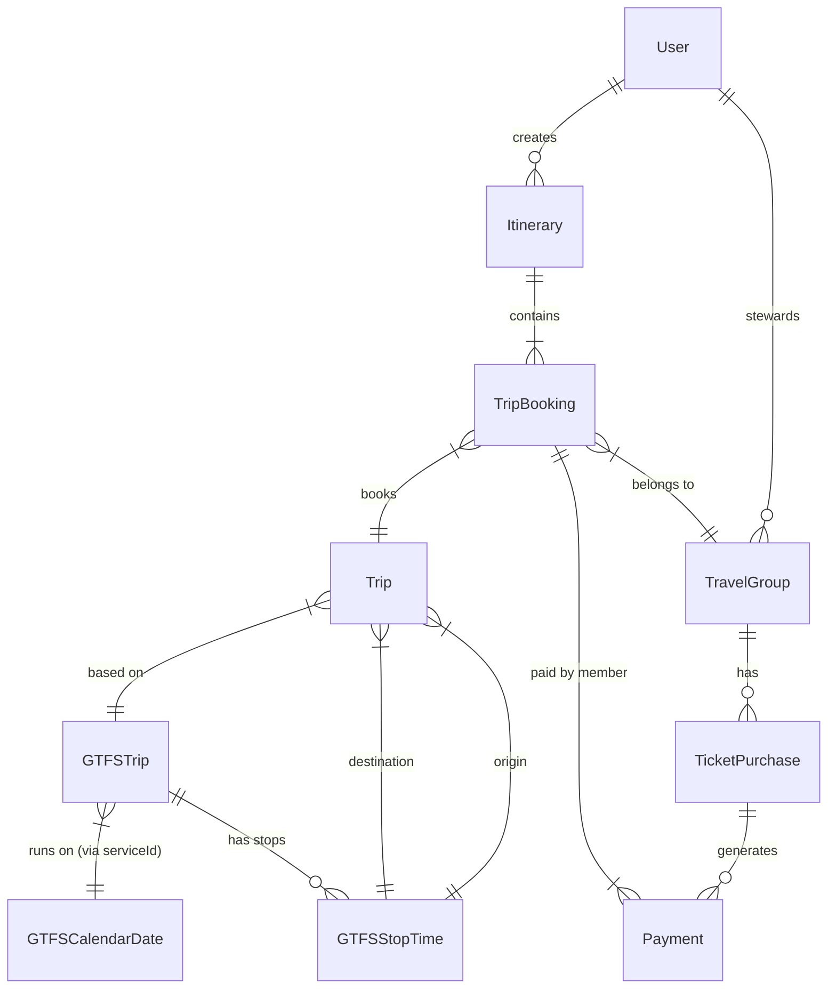

# Entity Design & Data Model

This document explains the core entity design for the Go Train Group Pass application, specifically focusing on how we model trips, schedules, and group coordination using Metrolinx GTFS data.

## 1. Core Trip Logic

The most critical part of the system is how we link a user's desire to travel (a "Trip") with the official schedule (GTFS).

### The `Trip` Entity
Represents a **specific segment** of a journey that a user or group intends to take.
*   **Purpose**: Acts as the anchor for coordination. Users join a `Trip`, not a generic train.
*   **Key Properties**:
    *   `gtfsTrip`: Links to the physical train schedule (see below).
    *   `originStopTime`: The specific stop where the group boards (e.g., "Kitchener").
    *   `destinationStopTime`: The specific stop where the group disembarks (e.g., "Union").
    *   `date` (Virtual): The specific calendar date of travel (e.g., `2025-11-21`). derived from `gtfsTrip.serviceId`.

### The `GTFSTrip` Entity
Represents a **scheduled train run** on a specific service day.
*   **Source**: Metrolinx GTFS `trips.txt`.
*   **Key Properties**:
    *   `serviceId`: A string representing the date (e.g., `"20251121"`).
    *   **Note**: In this specific dataset, `service_id` is 1:1 with calendar dates. This means every `GTFSTrip` is unique to a specific day.

### Metrolinx Specific Accommodations
Metrolinx uses a simplified (but verbose) approach to GTFS scheduling:
*   **No `calendar.txt`**: They do not define recurring patterns (e.g., "Mon-Fri").
*   **Exploded Schedule**: Instead, they use `calendar_dates.txt` with `exception_type = 1` (Service Added) to explicitly list every single day a train runs.
*   **Service ID = Date**: The `service_id` itself is just the date string (e.g., `20251121`).

**Architectural Decision**:
Because of this, we removed the explicit `date` column from the `Trip` entity in the database to avoid update anomalies. Instead, we use a **Virtual Property** on the `Trip` entity that parses the date directly from the `GTFSTrip.serviceId`. This ensures the `Trip` date is always perfectly in sync with the underlying GTFS data.

### The `GTFSCalendarDate` Entity
Represents the service availability.
*   **Source**: Metrolinx GTFS `calendar_dates.txt`.
*   **Purpose**: Confirms that a `service_id` is active on a given date.
*   **Key Properties**:
    *   `serviceId`: Links to `GTFSTrip`.
    *   `date`: The actual date object.
    *   `exceptionType`: `1` (Service Added) means the train runs.

---

## 2. Group Coordination Flow

### Pre-Planning (Interest)
1.  User searches for a train (e.g., Kitchener to Union on Nov 21).
2.  System finds the matching `GTFSTrip` and `GTFSStopTime`s.
3.  System creates (or finds) a `Trip` entity for that segment.
4.  User creates a `TripBooking` linked to that `Trip`.

### The `Itinerary` Entity
Represents the user's **entire journey plan**, which typically consists of multiple segments (e.g., a Round Trip).
*   **Purpose**: Groups multiple `TripBooking`s together so the user can manage their day as a single unit.
*   **Key Properties**:
    *   `user`: The person traveling.
    *   `tripBookings`: A collection of bookings (e.g., [Outbound Booking, Return Booking]).
    *   `wantsToSteward`: Indicates if the user is willing to be a steward for *any* of the segments in this itinerary.

### Group Formation
*   **`TripBooking`**: Represents one person's seat on a `Trip`.
    *   `status`: `PENDING` -> `GROUPED`.
    *   `group`: Links to a `TravelGroup` once assigned.
*   **`TravelGroup`**: A collection of up to 5 `TripBooking`s.
    *   `steward`: The user responsible for buying tickets.
    *   `status`: `FORMING` -> `FINALIZED`.

### Payment & Execution
*   **`TicketPurchase`**: Evidence that the steward bought the pass.
    *   `ticketImageUrl`: Screenshot of the pass.
*   **`Payment`**: Tracks reimbursement.
    *   `amountOwed`: Calculated share of the pass.
    *   `isPaid`: Confirmed via e-transfer.

---

## 4. Entity Relationship Diagram

## 3. Data Flow Example

**Scenario**: Alice wants to go from **Guelph** to **Union** on **Nov 21st**.

1.  **Lookup**:
    *   Find `GTFSTrip` where `serviceId = "20251121"`.
    *   Find `GTFSStopTime` for Guelph (Seq 2) and Union (Seq 10).
2.  **Trip Creation**:
    *   `Trip.gtfsTrip` = (The train found above).
    *   `Trip.origin` = Guelph Stop Time.
    *   `Trip.destination` = Union Stop Time.
    *   `Trip.date` = `2025-11-21` (Auto-calculated).
3.  **Booking**:
    *   `TripBooking` created for Alice, linked to this `Trip`.
## 5. Design Philosophy: Strict Normalization

A core architectural decision in this project is to adhere to **Strict Database Normalization**, particularly for our coordination entities (`Trip`, `TripBooking`, `TravelGroup`).

### Justification
1.  **Separation of Concerns**:
    *   Our application entities (`Trip`, `TripBooking`) are purely for **coordination**. They store *who* is traveling and *status* of the group.
    *   They do **not** store *schedule data* (times, platform numbers, train codes). Instead, they strictly reference the authoritative GTFS entities (`GTFSTrip`, `GTFSStopTime`).
    *   This keeps our coordination tables lightweight and focused. A `Trip` is just a set of pointers to the schedule, not a copy of the schedule.
2.  **Prevention of Drift**:
    *   If we stored `departureTime` on the `Trip` entity, we would risk it drifting from the `GTFSStopTime` it refers to. By forcing a join (or a virtual property lookup), we guarantee that the application always sees the exact time defined by the schedule.
3.  **Data Integrity**:
    *   We prevent **Update Anomalies**. For instance, the `date` of a trip is inherent to the `GTFSTrip` (via `service_id`). Storing it again on the `Trip` entity would allow for a state where `Trip.date` says "Monday" but `Trip.gtfsTrip` points to a "Tuesday" train. Our normalized design makes this impossible.

### Financial & Group Logic
This philosophy extends to our group management and payment entities:
1.  **`TravelGroup`**: Acts as a container. It does not store "total cost" or "member count" as hard columns. Instead, these are derived from the associated `TripBooking`s and `TicketPurchase`s.
2.  **`Payment`**:
    *   Links strictly to a `TripBooking` (the debtor) and a `TicketPurchase` (the debt).
    *   This allows us to trace every dollar back to a specific proof-of-purchase. We don't just say "Alice owes Bob $10"; we say "Alice owes Bob $10 for *this specific ticket*".
3.  **`TicketPurchase`**:
    *   Stores the evidence (image URL) and the total cost.
    *   It does not store "who paid what". That is the job of the `Payment` entity.
    *   This separation allows for complex scenarios (e.g., partial payments, multiple tickets per group) without breaking the schema.

### MVP Strategy: Normalize First, Optimize Later
*   **Read vs. Write Patterns**:
    *   This application is **Read-Heavy** (users checking schedules, status) but with critical **Write Integrity** requirements (payments, group formation).
    *   While normalization can make reads slightly more expensive (due to joins), modern PostgreSQL handles these joins effortlessly at our expected MVP scale.
*   **Evolutionary Design**:
    *   Starting with a highly normalized schema gives us maximum flexibility. It is much easier to **denormalize** later (e.g., adding a `cached_total_cost` column) for performance than it is to try and fix data consistency issues in a prematurely denormalized schema.
    *   For the MVP, correctness is our primary metric. We can optimize for speed once we have real traffic data.

### Group Matching Optimization
*   **Shared Trip Entities**:
    *   We enforce a **Unique Constraint** on `[gtfsTrip, originStopTime, destinationStopTime]`.
    *   This means if 50 people book the "8:00 AM Kitchener to Union" train, they all point to the **same** `Trip` row (e.g., UUID `123`).
    *   **Benefit**: Group matching becomes a simple set comparison. To see if User A and User B have the same itinerary, we just check if their `TripBooking`s point to the same set of `Trip` IDs. No complex time/stop comparisons required.

This design ensures that we can always validate the sequence of stops (Origin < Destination) and the exact date of travel.
