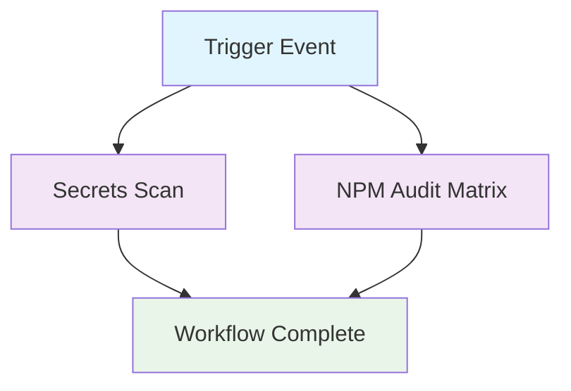

## Workflow Overview

**Purpose**: Maintain repository hygiene by scanning for leaked secrets and auditing npm dependencies on every critical change window.
**Trigger Events**: `workflow_dispatch` (manual), `schedule` (weekly), `push` (branch: main), `pull_request` (all branches)
**Target Environments**: CivicTechWR/go-train-group-pass repository; backend workspace matrix; pull-request contexts

## Execution Flow Diagram



## Jobs & Dependencies

| Job Name | Purpose | Dependencies | Execution Context |
|----------|---------|--------------|-------------------|
| gitleaks | Detect potential secret disclosures using reusable scan workflow | None | GitHub-hosted Ubuntu runner via reusable workflow |
| npm-audit | Audit npm dependencies for known vulnerabilities across defined workspaces | None | GitHub-hosted Ubuntu runner with matrix parameter `workspace` |

## Requirements Matrix

### Functional Requirements
| ID | Requirement | Priority | Acceptance Criteria |
|----|-------------|----------|---------------------|
| REQ-001 | Perform a redacted GitLeaks scan on every trigger and publish a human-readable summary | High | Step summary shows findings status; artifact uploaded when leaks detected |
| REQ-002 | Execute `npm audit` (high severity threshold) for each configured workspace with retry protection | High | Job completes without unhandled exit; retries fire after first failure |
| REQ-003 | Notify maintainers of secret findings on pull requests | Medium | Pull request comment tags `@CivicTechWR/organizers` when leaks exist |

### Security Requirements
| ID | Requirement | Implementation Constraint |
|----|-------------|---------------------------|
| SEC-001 | Protect licensed GitLeaks usage from unauthorized exposure | License read from `GITLEAKS_LICENSE` secret; scan skips when unavailable |
| SEC-002 | Prevent accidental disclosure of secret material in logs | GitLeaks runs with `--redact`; summaries exclude secret values |
| SEC-003 | Limit workflow token capabilities to least privilege | Workflow inherits `actions: write`, `contents: read`, `pull-requests: write` |

### Performance Requirements
| ID | Metric | Target | Measurement Method |
|----|--------|--------|---------------------|
| PERF-001 | GitLeaks scan duration | ≤ 3 minutes | Compare job timestamps in run history |
| PERF-002 | NPM audit duration per workspace | ≤ 12 minutes | Matrix job timing |
| PERF-003 | Workflow completion time | ≤ 20 minutes | End-to-end run duration |

## Input/Output Contracts

### Inputs

```yaml
# Environment Variables
NEXT_PUBLIC_SUPABASE_URL: string  # Purpose: Provide dummy Supabase URL expected by backend config
NEXT_PUBLIC_SUPABASE_ANON_KEY: string  # Purpose: Dummy anon key for backend build scripts
SUPABASE_SERVICE_ROLE_KEY: string  # Purpose: Placeholder service role required by security scripts
ENABLE_ADMIN_APIS: string  # Purpose: Feature flag toggle required by backend bootstrapping
ADMIN_API_TOKEN: string  # Purpose: Non-sensitive placeholder for admin token references
NEXT_PUBLIC_ENABLE_DEMO_PAGE: string  # Purpose: Disable demo-specific flows during audits

# Repository Triggers
branches: [main]
paths: null  # Workflow runs on all paths
events:
  - workflow_dispatch: {}
  - schedule: '0 9 * * 1'
  - pull_request: '*'
  - push: 'main'
```

### Outputs

```yaml
# Job Outputs
gitleaks_report: file  # Description: Redacted JSON artifact attached when leaks detected
gitleaks_summary: string  # Description: Step summary status shared in workflow run
pr_comment: annotation  # Description: Conditional notification for pull requests with findings
```

### Secrets & Variables

| Type | Name | Purpose | Scope |
|------|------|---------|-------|
| Secret | GITLEAKS_LICENSE | Enables licensed GitLeaks scanning | Organization / repository |
| Secret | GITHUB_TOKEN | Authenticates GitHub API interactions | Workflow |
| Variable | workspace (matrix) | Identifies target project directories | Workflow job |

## Execution Constraints

### Runtime Constraints

- **Timeout**: Default GitHub Actions limit (6 hours) covers worst case; expected < 20 minutes
- **Concurrency**: No concurrency group; jobs execute in parallel per run
- **Resource Limits**: Standard GitHub-hosted runner CPU/memory allowances

### Environmental Constraints

- **Runner Requirements**: Ubuntu GitHub-hosted runners with sudo access for CLI install
- **Network Access**: Outbound HTTPS required for GitHub API, GitLeaks release download, npm registry
- **Permissions**: Requires token scopes `actions: write`, `contents: read`, `pull-requests: write`

## Error Handling Strategy

| Error Type | Response | Recovery Action |
|------------|----------|-----------------|
| GitLeaks failure without findings | Logs warning and marks step outcome; workflow continues | Investigate action logs; rerun after resolving environment issues |
| Missing GitLeaks license | Produces notice and skips scan | Provide `GITLEAKS_LICENSE` secret at org or repo scope |
| NPM audit transient failure | Retry once after 30-second wait | Review dependency vulnerabilities; rerun if failures persist |
| NPM audit reports vulnerabilities | Job fails after retry | Remediate packages or acknowledge via dependency updates |

## Quality Gates

### Gate Definitions

| Gate | Criteria | Bypass Conditions |
|------|----------|-------------------|
| Secrets Scan | Zero findings or documented remediation plan | Scan skipped when license unavailable |
| Dependency Audit | No high-severity vulnerabilities reported | Temporary waiver requires manual approval outside workflow |

## Monitoring & Observability

### Key Metrics

- **Success Rate**: Target ≥ 95% of scheduled runs complete without infrastructure error
- **Execution Time**: Track total runtime against 20-minute budget via workflow analytics
- **Resource Usage**: Monitor runner CPU/memory via GitHub-hosted telemetry when diagnosing slowness

### Alerting

| Condition | Severity | Notification Target |
|-----------|----------|---------------------|
| GitLeaks findings on pull request | High | `@CivicTechWR/organizers` via automated comment |
| Workflow run failure on main branch | Medium | Repository maintainers through GitHub notifications |
| Repeated scan skips due to missing license | Medium | DevOps Team via run summaries |

## Integration Points

### External Systems

| System | Integration Type | Data Exchange | SLA Requirements |
|--------|------------------|---------------|------------------|
| GitLeaks release repository | Artifact download | Fetch CLI tarball over HTTPS | Availability of GitHub Releases |
| npm registry | Package metadata query | `npm audit` vulnerability reports | Standard npm uptime |

### Dependent Workflows

| Workflow | Relationship | Trigger Mechanism |
|----------|--------------|-------------------|
| None | N/A | N/A |

## Compliance & Governance

### Audit Requirements

- **Execution Logs**: Retain GitHub Actions logs per GitHub default (90 days) for audit trail
- **Approval Gates**: None embedded; findings routed to organizers for manual decision
- **Change Control**: Updates to workflow require spec revision, PR review, and merge to main

### Security Controls

- **Access Control**: Workflow restricted to repository maintainers; secrets managed at organization scope
- **Secret Management**: `GITLEAKS_LICENSE` stored as organization secret; rotate per vendor guidance
- **Vulnerability Scanning**: Weekly schedule ensures recurrent coverage alongside event triggers

## Edge Cases & Exceptions

### Scenario Matrix

| Scenario | Expected Behavior | Validation Method |
|----------|-------------------|-------------------|
| Fork pull request without shared secrets | GitLeaks scan skips; workflow reports notice | Confirm summary message and absence of artifact |
| Additional workspace added to matrix without package-lock | NPM audit step fails fast | CI dry-run after matrix update |
| Large finding count (>10) | Comment truncates list and references artifact | Inspect PR comment formatting |

## Validation Criteria

### Workflow Validation

- **VLD-001**: Manual dispatch or PR run produces GitLeaks summary with accurate status text
- **VLD-002**: Dependency vulnerability intentionally introduced causes npm audit job failure after retry

### Performance Benchmarks

- **PERF-001**: GitLeaks job remains under 3 minutes on repository history of current size
- **PERF-002**: NPM audit job remains under 12 minutes with cached dependencies

## Change Management

### Update Process

1. **Specification Update**: Revise this document prior to modifying workflow YAML
2. **Review & Approval**: Obtain DevOps Team review for spec and workflow PR
3. **Implementation**: Apply approved changes to `.github/workflows/security.yml`
4. **Testing**: Trigger workflow via pull request to validate new behavior
5. **Deployment**: Merge to main after successful run and stakeholder sign-off

### Version History

| Version | Date | Changes | Author |
|---------|------|---------|--------|
| 1.0 | 2025-11-14 | Initial specification | DevOps Team |

## Related Specifications

- Pending reusable workflow spec once migrated to central `.github` repository
- Refer to npm dependency management guidelines (separate document) for remediation processes
