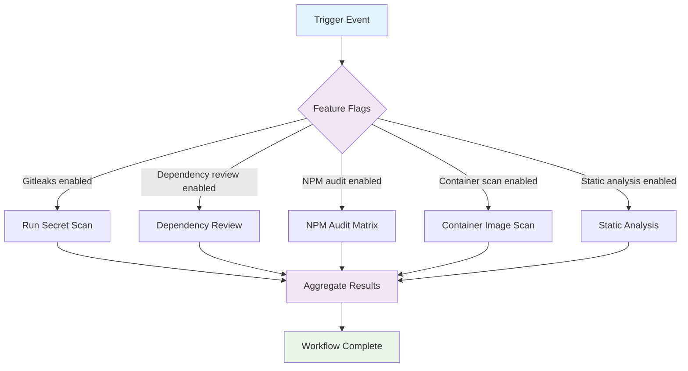

## Workflow Overview

**Purpose**: Provide an organization-wide security pipeline that delivers consistent, opt-in scanning while remaining non-blocking by default.
**Trigger Events**: `workflow_call`, optional `workflow_dispatch`, inherits caller triggers
**Target Environments**: CivicTechWR repositories spanning Node.js, containerized, and static codebases

## Execution Flow Diagram



## Jobs & Dependencies

| Job Name | Purpose | Dependencies | Execution Context |
|----------|---------|--------------|-------------------|
| configure | Resolve input flags, auto-detect project capabilities | None | Lightweight job on GitHub-hosted runner |
| gitleaks | Scan repository history for secrets (conditional) | configure | GitHub-hosted Ubuntu runner |
| dependency-review | Evaluate dependency graph changes for known issues (conditional) | configure | GitHub-hosted Ubuntu runner |
| npm-audit | Audit Node.js workspaces using `npm audit` (conditional/matrix) | configure | GitHub-hosted Ubuntu runner |
| container-scan | Scan container images or Dockerfiles (conditional) | configure | GitHub-hosted runner with container tooling |
| sast | Execute static analysis (e.g., CodeQL) when enabled | configure | GitHub-hosted runner, language-specific |
| summarize | Consolidate findings, post comments, control blocking | Needs all enabled jobs | GitHub-hosted Ubuntu runner |

## Requirements Matrix

### Functional Requirements

| ID | Requirement | Priority | Acceptance Criteria |
|----|-------------|----------|---------------------|
| REQ-001 | Support selective activation of each security check via inputs or auto-detection | High | Workflow skips disabled checks without error |
| REQ-002 | Produce a consolidated security summary for every run | High | Summary step includes status per enabled check |
| REQ-003 | Provide reusable outputs that callers can evaluate for gating | Medium | Workflow outputs boolean flags and counts |

### Security Requirements

| ID | Requirement | Implementation Constraint |
|----|-------------|---------------------------|
| SEC-001 | Handle secrets (e.g., license keys, API tokens) securely | All sensitive data sourced from GitHub Secrets; no logging of values |
| SEC-002 | Minimize token privileges | Workflow `permissions` default to read-only with job-level elevation as needed |
| SEC-003 | Offer monitor mode with optional enforcement | Blocking behavior controlled by inputs per check |

### Performance Requirements

| ID | Metric | Target | Measurement Method |
|----|--------|--------|---------------------|
| PERF-001 | Configuration job runtime | ≤ 1 minute | Job duration metrics |
| PERF-002 | Individual scan runtime | ≤ 15 minutes per job | Job timing per execution |
| PERF-003 | Aggregate workflow duration | ≤ 45 minutes for full suite | Run timeline on largest repo |

## Input/Output Contracts

### Inputs

```yaml
# Workflow Inputs (workflow_call)
enable_gitleaks: boolean  # Purpose: Toggle secret scanning
enable_dependency_review: boolean  # Purpose: Toggle dependency review analysis
enable_npm_audit: boolean  # Purpose: Toggle Node.js audit job
enable_container_scan: boolean  # Purpose: Toggle container scanning stage
enable_sast: boolean  # Purpose: Toggle static analysis stage
auto_detect: boolean  # Purpose: Enable auto-enablement based on repo contents
monitor_mode: boolean  # Purpose: If true, downgrade failures to warnings

# Environment Variables (optional via inputs or defaults)
WORKSPACE_LIST: string  # Purpose: Comma-separated workspaces for package audits
CONTAINER_TARGETS: string  # Purpose: Image tags or Dockerfile paths to scan

# Repository Triggers
inherited_from_caller: true  # Workflow relies on caller triggers when invoked via workflow_call
```

### Outputs

```yaml
# Workflow Outputs
has_findings: boolean  # Description: True when any enabled check reports findings
findings_breakdown: string  # Description: Serialized summary of per-check counts
blocking_checks: string  # Description: List of checks that triggered blocking failures
artifact_bundle: file  # Description: Aggregated reports archive when findings exist
```

### Secrets & Variables

| Type | Name | Purpose | Scope |
|------|------|---------|-------|
| Secret | GITLEAKS_LICENSE | Authorize licensed secret scans | Organization |
| Secret | CODEQL_TOKEN (optional) | Enable CodeQL uploads if required | Repository |
| Variable | DEFAULT_WORKSPACES | Provide fallback workspace list | Repository |
| Variable | DEFAULT_CONTAINER_TARGETS | Provide fallback image targets | Repository |

## Execution Constraints

### Runtime Constraints

- **Timeout**: Each job capped at default 360 minutes; guidance to set 30-minute limit per job once baselined
- **Concurrency**: Recommend concurrency group keyed by branch to prevent overlapping security runs
- **Resource Limits**: Requires runners with Docker access for container scanning

### Environmental Constraints

- **Runner Requirements**: Ubuntu runners with ability to install language-specific tooling and container scanning tools
- **Network Access**: Outbound HTTPS to GitHub, package registries, container registries; optional OCI registry auth via secrets
- **Permissions**: Minimal read permissions with selective elevation (`security-events: write` for CodeQL, etc.)

## Error Handling Strategy

| Error Type | Response | Recovery Action |
|------------|----------|-----------------|
| Optional job disabled | Log notice, skip job | None |
| Tool execution failure | Respect monitor mode: warn if enabled, fail if blocking | Rerun after remediation or adjust monitor flag |
| Missing prerequisite (e.g., package-lock.json) | Skip job with guidance message | Update configuration or provide inputs |
| Artifact upload failure | Emit warning, retry automatically where supported | Manual upload if critical |

## Quality Gates

### Gate Definitions

| Gate | Criteria | Bypass Conditions |
|------|----------|-------------------|
| Secret Scan | No secret findings when blocking enabled | Monitor mode or missing license |
| Dependency Review | No critical vulnerabilities introduced | Monitor mode active |
| Package Audit | No high-severity npm findings | Monitor mode or approved exception |
| Container Scan | No critical CVEs in images | Monitor mode |
| Static Analysis | No high-severity alerts | Monitor mode |

## Monitoring & Observability

### Key Metrics

- **Success Rate**: ≥ 98% successful runs excluding intentional failures
- **Execution Time**: Track per-job durations via workflow telemetry
- **Finding Trends**: Aggregate outputs to dashboards for recurring issues

### Alerting

| Condition | Severity | Notification Target |
|-----------|----------|---------------------|
| Secret findings on PR | High | `@CivicTechWR/organizers` or configured team |
| Critical vulnerability detected | High | Security channel via GitHub notifications |
| Repeated skips due to missing config | Medium | DevOps Team |

## Integration Points

### External Systems

| System | Integration Type | Data Exchange | SLA Requirements |
|--------|------------------|---------------|------------------|
| GitHub Dependency Graph | API integration | Dependency metadata & advisories | GitHub uptime |
| Package Registries | CLI tool access | Vulnerability/advisory data | Registry uptime |
| Container Registry | Registry API | Image pulls for scanning | Registry uptime |

### Dependent Workflows

| Workflow | Relationship | Trigger Mechanism |
|----------|--------------|-------------------|
| Repository security workflows | Caller | `workflow_call` |
| Incident response workflows | Optional downstream | Triggered manually when findings escalate |

## Compliance & Governance

### Audit Requirements

- **Execution Logs**: Retain GitHub Actions logs per policy (90 days) with option to export critical reports
- **Approval Gates**: None enforced in workflow; teams escalate findings via documented response guides
- **Change Control**: Spec updated prior to YAML modifications; changes require DevOps approval

### Security Controls

- **Access Control**: Workflow stored centrally with restricted write access
- **Secret Management**: Organization secrets managed with rotation schedule; monitor for unused secrets
- **Vulnerability Scanning**: Weekly minimum cadence enforced via caller schedules

## Edge Cases & Exceptions

### Scenario Matrix

| Scenario | Expected Behavior | Validation Method |
|----------|-------------------|-------------------|
| Repository without Node.js project | NPM audit job auto-skips with notice | Simulate run with missing package manifests |
| Forked PR without shared secrets | Secret scan skips due to missing license | Validate summary output |
| Multiple workspaces defined | Matrix runs sequentially per workspace | Review job logs for each workspace |
| Monitor mode active | Findings reported but exit status success | Check outputs to confirm non-blocking |

## Validation Criteria

### Workflow Validation

- **VLD-001**: Enabling each feature individually triggers only the relevant job
- **VLD-002**: Auto-detect mode enables jobs when expected files are present
- **VLD-003**: Monitor mode delivers warnings without failing workflow while still surfacing outputs

### Performance Benchmarks

- **PERF-001**: Full suite run completes within 45 minutes on representative repository
- **PERF-002**: Single job execution time remains under defined caps when caches available

## Change Management

### Update Process

1. **Specification Update**: Amend this document before altering workflow inputs or job composition
2. **Review & Approval**: Obtain DevOps Team approval for spec and code changes
3. **Implementation**: Modify central workflow in CivicTechWR/.github repository
4. **Testing**: Validate via canary repositories before organization-wide rollout
5. **Deployment**: Update consuming repositories to reference new version/tag

### Version History

| Version | Date | Changes | Author |
|---------|------|---------|--------|
| 1.0 | 2025-11-14 | Initial cross-org security suite specification | DevOps Team |

## Related Specifications

- `spec-process-cicd-security-audit.md` for repository-level implementation details
- Future specs for stack-specific reusable jobs (e.g., container scans, SAST configurations)
